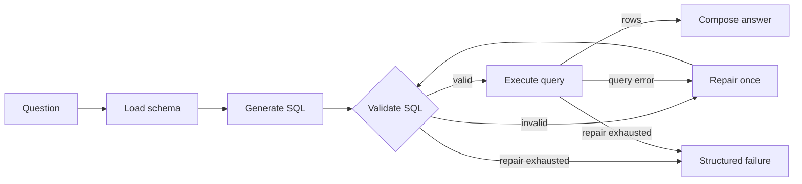

## Start here

Enterprise Agents on Microsoft Foundry is a progressive, notebook-first learning
project. You begin with a brownfield agent, establish a modern Python and Azure
foundation, and then rebuild the agent as an explicit LangGraph workflow.

The working example is intentionally small: a Text-to-SQL agent answers business
questions from the AdventureWorksLT sample database. The SQL use case makes
enterprise concerns concrete. You can see where model output crosses a trust
boundary, where deterministic checks belong, how identity reaches Azure, and how
an agent should fail when it cannot safely answer.

This is not a finished product template or a collection of isolated demos. Each
release is a readable checkpoint in one evolving implementation. Production code
lives under `src/`; notebooks import that code and explain it rather than creating
a second implementation.

> [!TIP]
> You do not need an Azure subscription to begin. Complete the local setup, run
> the offline tests, and study the first two notebooks before provisioning
> anything.

## What you will learn

By working through the repository, you will learn how to:

* Separate configuration, database access, model access, graph control flow, and
  presentation into testable boundaries.
* Model LangGraph input, working state, routes, and output with explicit Python
  types.
* Treat model-generated SQL as untrusted input and validate it before execution.
* Bound retries, row counts, query time, and graph recursion rather than relying
  on prompt instructions.
* Authenticate to Microsoft Foundry and Azure SQL with Microsoft Entra instead of
  storing API keys or database passwords.
* Use fake model and database implementations for fast offline tests, then keep
  live Azure checks in a separately marked integration suite.
* Capture architectural decisions, measurements, limitations, and deferred scope
  as part of a release.

## Agent mental model

The model is a writer, not the decision-maker. It drafts SQL, repairs SQL once,
and summarizes rows already returned by the database. LangGraph controls the
route, deterministic Python validates every statement, and the database identity
provides the final read-only boundary.



The happy path uses two model calls: one to draft SQL and one to explain the
result. A repair path uses one additional call. Prompt instructions improve model
behavior, but they are not security controls. The validator, database client,
and database permissions enforce the rules.

## Current release

`v0.5: Hosted Agent on Microsoft Foundry`

v0.5 packages the agent as a Microsoft Foundry Hosted Agent reached over the
Responses protocol. The graph is unchanged. What is new is a protocol adapter, a
container image, and a run-time identity: the agent authenticates to the model
and to Azure SQL as itself rather than as you. See
[docs/releases/v0.5.md](docs/releases/v0.5.md).

Earlier checkpoints remain readable in order.

| Release | Theme | Notes |
| --- | --- | --- |
| v0.1 | Azure foundation | [docs/releases/v0.1.md](docs/releases/v0.1.md) |
| v0.2 | Modern Python foundation | [docs/releases/v0.2.md](docs/releases/v0.2.md) |
| v0.3 | Explicit LangGraph agent | [docs/releases/v0.3.md](docs/releases/v0.3.md) |
| v0.4 | Model and tool contracts | [docs/releases/v0.4.md](docs/releases/v0.4.md) |
| v0.5 | Hosted Agent on Foundry | [docs/releases/v0.5.md](docs/releases/v0.5.md) |

## Choose your learning path

### Local path

Start here. This path requires Python and `uv`, but no Azure resources.

1. Install the local prerequisites.
2. Synchronize the Python environment.
3. Run the offline test suite.
4. Work through notebooks 00 and 01.
5. Study the scripted LangGraph scenarios in notebook 02.

Database and live-model cells report why they were skipped when Azure is not
configured. A skip is expected on the local path and is different from a failed
test.

### Azure path

Continue here when you are ready to run the database and model examples.

1. Complete the local path.
2. Install the Azure tools and ODBC driver.
3. Sign in and select an Azure subscription.
4. Review the planned topology and billable resources.
5. Provision with `azd`.
6. Bootstrap read-only database access.
7. Run the Azure integration tests and live notebook cells.
8. Delete the environment when you finish.

## Prerequisites

### Required for local learning

* [Git](https://git-scm.com/downloads)
* [Python 3.12 or later](https://www.python.org/downloads/)
* [uv](https://docs.astral.sh/uv/getting-started/installation/)
* [Visual Studio Code](https://code.visualstudio.com/) with the Python and
  Jupyter extensions, or another Jupyter-compatible editor

Confirm the tools are available:

```console
python --version
uv --version
git --version
```

### Additional requirements for Azure

* An Azure subscription with permission to create resource groups and role
  assignments
* [Azure CLI](https://learn.microsoft.com/cli/azure/install-azure-cli)
* [Azure Developer CLI](https://learn.microsoft.com/azure/developer/azure-developer-cli/install-azd)
* The Bicep CLI available through `az bicep`
* [Microsoft ODBC Driver 18 for SQL Server](https://learn.microsoft.com/sql/connect/odbc/download-odbc-driver-for-sql-server)

Install the ODBC driver on Windows from an elevated terminal:

```console
winget install --id Microsoft.msodbcsql18
```

Open a new terminal after installation so the registered driver is visible.
The ODBC driver is a system component; `uv sync` cannot install it.

Verify the Azure tools:

```console
az version
azd version
az bicep version
```

## Set up the project locally

From the repository root, synchronize the locked Python environment:

```console
uv sync
```

Create a local configuration file. Use the command for your shell.

Windows PowerShell:

```powershell
Copy-Item .env.example .env
```

Windows Command Prompt:

```bat
copy .env.example .env
```

macOS or Linux:

```bash
cp .env.example .env
```

The empty Azure values are fine for the local path. Do not add passwords,
access tokens, API keys, or connection strings to `.env`. After Azure
provisioning, `scripts/write_env_from_azd.py` writes non-secret deployment
outputs into this file.

Run the offline quality checks:

```console
uv run pytest -m "not azure"
uv run ruff check .
uv run ruff format --check .
uv run mypy src scripts
```

The offline pytest command is the definitive local code check and does not
contact Azure. Run `uv run eaof-verify` when you want a report covering both
local prerequisites and Azure readiness.

## Work through the notebooks

Open the notebooks in this order. Run one cell at a time and read the Markdown
before moving on; the explanation and production code are designed to be read
together.

| Order | Notebook | Learning outcome | Azure needed |
| --- | --- | --- | --- |
| 1 | [00: Brownfield baseline and Azure bootstrap](notebooks/00_brownfield_baseline_and_azure_bootstrap.ipynb) | Compare the legacy system with the target architecture and understand the Azure foundation | No for analysis; yes for provisioning |
| 2 | [01: Modern Python foundation](notebooks/01_modern_python_foundation.ipynb) | Explore typed settings, errors, package boundaries, database access, commands, and test separation | No |
| 3 | [01.1: Explore AdventureWorksLT](notebooks/01.1_explore_adventureworks.ipynb) | Inspect schemas, tables, keys, safe queries, and the metadata supplied to the agent | Yes for live queries |
| 4 | [02: Modern LangGraph Text-to-SQL](notebooks/02_modern_langgraph_text_to_sql.ipynb) | Follow typed graph state, routing, validation, repair, execution, structured success, and structured failure | No for scripted scenarios; yes for the live run |
| 5 | [03: Model and tool contracts](notebooks/03_model_and_tool_contracts.ipynb) | Read the typed model and query-tool boundaries, the four query statuses, and the six terminal outcomes | No |
| 6 | [04: Hosted Agent on Foundry](notebooks/04_hosted_agent_on_foundry.ipynb) | Trace the Responses adapter, the container boundary, the three identities, and the deployed endpoint | No for the adapter and design cells; yes for the remote call |

Notebooks 01.1, 02, and 04 handle an unavailable database or an undeployed agent
by printing a concise skip reason. Install ODBC Driver 18, sign in with
`az login`, and provision the Azure environment before expecting live output.

## Provision the Azure learning environment

> [!IMPORTANT]
> Provisioning creates billable Azure resources. The pre-provision hook prints
> the region, topology, model deployment, and billable resources before Azure
> receives a deployment request. Read that output before continuing.

Sign in to both command-line tools. The application uses the Azure CLI identity
locally for Microsoft Entra data-plane access, while `azd` manages the
environment and deployment.

```console
az login
azd auth login
az account show
```

Create the `azd` environment, inspect the plan, and provision:

```console
azd env new dev
uv run python scripts/preprovision_check.py
azd provision
```

The `azure.yaml` hooks run the pre-provision check again and then copy Bicep
outputs into `.env`. Provisioning alone leaves the agent running from your
workstation. Deploying it as a Hosted Agent is a separate step:

```console
azd deploy text-to-sql-agent
azd ai agent show text-to-sql-agent
```

The deployed agent runs under its own Entra identity, which starts with no
permissions. Granting that identity database and model access is described in
the [Hosted Agent architecture](docs/architecture/v0.5-hosted-agent.md).

Grant the signed-in learner read-only access to AdventureWorksLT and verify the
environment:

```console
uv run --extra database python scripts/bootstrap_database.py
uv run eaof-verify
uv run eaof-db-info
uv run pytest -m azure
```

The bootstrap path is the only intentionally administrative database operation.
It checks `ALLOW_DATABASE_BOOTSTRAP=true`, prints the resolved target, and grants
read-only access. Agent-generated SQL never uses this path.

When you finish the Azure exercises, remove the environment:

```console
azd down --purge
```

The full topology, naming scheme, identity model, schema evidence, and cost
summary are in the
[Azure foundation architecture](docs/architecture/v0.1-azure-foundation.md).

## Understand the implementation boundaries

The package is organized by responsibility rather than by notebook or release.

```text
Question
  -> hosting/responses.py     maps one protocol turn onto the agent contract
  -> agents/state.py          validates input and defines working state
  -> agents/graph.py          chooses the next node with deterministic routes
  -> agents/nodes.py          performs one operation per graph node
  -> agents/model.py          calls the configured Foundry model
  -> database/validation.py   accepts or rejects generated SQL
  -> database/tool.py         reports one typed outcome per statement
  -> database/connection.py   executes through one read-only boundary
  -> AgentOutput              returns the same shape for success or failure
```

The protocol boundary is optional. `hosting/` imports `agents/`, and nothing in
`agents/` imports `hosting/`, so the agent runs identically in a notebook, a
test, and a container.

The main division of responsibility is:

| Component | Allowed responsibility | Explicitly not responsible for |
| --- | --- | --- |
| Model | Draft SQL, repair it once, decline, summarize returned rows | Routing, execution, credentials, or deciding whether SQL is safe |
| LangGraph | Move typed state through a fixed workflow | Interpreting database permissions or hiding failures |
| SQL validator | Enforce one read-only `SELECT` or `WITH` statement | Deciding whether the answer is useful |
| Database client | Revalidate, execute, enforce timeout and row limits | Generating or repairing SQL |
| Database identity | Provide the final `db_datareader` safety boundary | Trusting application validation |
| Protocol adapter | Map one turn in and one sentence out | Any agent logic, and leaking an internal reason |

## Useful commands

Two project commands are installed by `uv sync`.

| Command | Purpose |
| --- | --- |
| `uv run eaof-verify` | Report whether the workstation, configuration, and Azure environment are ready |
| `uv run eaof-db-info` | Inspect the configured database through the read-only client |

Both return `0` when checks pass, `1` when checks run and find a problem, and `2`
when checks cannot run. This distinction keeps a missing prerequisite separate
from an unhealthy Azure resource.

The full repository quality gate is:

```console
uv sync
uv run pytest -m "not azure"
uv run pytest -m azure
uv run ruff check .
uv run ruff format --check .
uv run mypy src scripts
az bicep build --file infra/main.bicep
```

The Azure tests skip with a stated reason when the environment, identity, or
ODBC driver is unavailable. The offline suite runs on every change and is the
normal development feedback loop.

## Repository map

| Path | What to find there |
| --- | --- |
| `src/enterprise_agents_on_foundry/agents/` | Typed state, graph topology, nodes, prompts, model boundary, and schema context |
| `src/enterprise_agents_on_foundry/database/` | Target validation, Microsoft Entra connection, read-only execution, the query tool, and result models |
| `src/enterprise_agents_on_foundry/hosting/` | The Responses protocol adapter and the Hosted Agent entry point |
| `src/enterprise_agents_on_foundry/config/` | The one typed settings boundary for `.env` and process configuration |
| `src/enterprise_agents_on_foundry/observability/` | Timing and release measurement helpers |
| `src/enterprise_agents_on_foundry/cli/` | Thin command-line adapters over production package functions |
| `database/queries/` | Fixed, reviewed, read-only metadata and smoke queries |
| `database/seeds/adventureworks-lt/` | Database bootstrap guidance and the read-only grant script |
| `notebooks/` | Progressive lessons that import the production package |
| `tests/unit/` | Fast tests with fake dependencies and no Azure access |
| `tests/integration/` | Live tests marked `azure` |
| `infra/` | Subscription-scoped Bicep modules and generated deployment artifacts |
| `Dockerfile`, `azure.yaml` | The Hosted Agent image and its azd service definition |
| `docs/architecture/` | Architecture at each shipped checkpoint |
| `docs/adr/` | Individual architecture decisions and their tradeoffs |
| `docs/current-state/` | Evidence gathered from the brownfield implementation |
| `docs/releases/` | Scope, checks, measurements, and limitations for each release |
| `evals/datasets/` | Evaluation cases reserved for the evaluation release |

## Safety model

The project uses multiple controls because no single control is sufficient.

* Microsoft Entra authenticates model and database access; application settings
  accept no key, password, token, or secret.
* Azure SQL target names are validated before a connection is attempted.
* Generated SQL must contain exactly one statement beginning with `SELECT` or
  `WITH` and must not contain mutation, administrative, or stored-procedure
  keywords.
* The database client repeats validation immediately before execution.
* The Azure SQL principal has read-only permissions and explicitly denied writes.
* The deployed agent runs under its own Entra identity, separate from yours, and
  receives only the roles it needs to call the model and read the database.
* A protocol response carries one fixed sentence per outcome, so an internal
  reason, a driver error, or a connection string cannot reach a caller.
* Query timeout, result row count, repair attempts, and graph recursion are
  bounded in code.
* Optional infrastructure capabilities remain disabled until the release that
  teaches them.

The SQL validator is intentionally conservative and is not a complete T-SQL
parser. It may reject a harmless query containing a forbidden word in a string
literal. A false rejection is preferable to silently allowing a mutation in
this learning checkpoint.

## Troubleshooting

### ODBC Driver 18 is not installed

`pyodbc` is a Python package; the Microsoft ODBC driver is a separate system
installation. Install Driver 18 from an elevated terminal, open a new terminal,
and run:

```console
uv run eaof-verify
```

### Azure credentials are unavailable

Run both sign-in commands and confirm the intended subscription:

```console
az login
azd auth login
az account show
```

No credential should be copied into `.env`.

### Live tests are skipped

Read the skip reason printed by pytest. A skipped Azure test usually means one
of the following prerequisites is absent: provisioned outputs in `.env`, a
signed-in identity, database permissions, or ODBC Driver 18.

### A generated query is rejected

Rejection is expected when a statement is not a single read-only query. The
graph sends the exact validation or database error to one repair attempt. After
that attempt, it returns a structured failure instead of executing uncertain SQL
or inventing an answer.

## Reference project

The brownfield project lives at `../langgraph-agents-on-azure`. It is treated as
read-only and is never modified. Modernization claims in `docs/current-state/`
cite the relevant legacy source path so learners can compare evidence with the
replacement instead of accepting an undocumented judgment.
