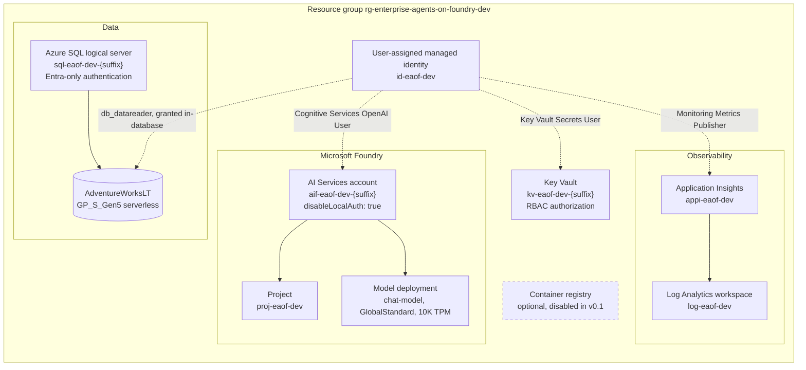

## Purpose

v0.1 provisions the platform that later releases build on. It deploys no
application and creates no agent. Everything here exists so that the LangGraph
modernization in later releases happens on a substrate that already handles
identity, least privilege, monitoring, and lifecycle correctly.

## Topology



## Resources

| Resource | Type | API version | Purpose |
| --- | --- | --- | --- |
| Resource group | `Microsoft.Resources/resourceGroups` | 2024-11-01 | Container for the entire footprint |
| Foundry account | `Microsoft.CognitiveServices/accounts` | 2025-06-01 | AI Services account with project management enabled |
| Foundry project | `Microsoft.CognitiveServices/accounts/projects` | 2025-06-01 | Child project scoping agents and connections |
| Model deployment | `Microsoft.CognitiveServices/accounts/deployments` | 2025-06-01 | One inexpensive chat model |
| SQL server | `Microsoft.Sql/servers` | 2023-08-01 | Logical server, Entra-only |
| SQL database | `Microsoft.Sql/servers/databases` | 2023-08-01 | Serverless AdventureWorksLT |
| Log Analytics | `Microsoft.OperationalInsights/workspaces` | 2023-09-01 | Telemetry store |
| Application Insights | `Microsoft.Insights/components` | 2020-02-02 | Workspace-based application telemetry |
| Key Vault | `Microsoft.KeyVault/vaults` | 2024-11-01 | Secret storage for later releases |
| Managed identity | `Microsoft.ManagedIdentity/userAssignedIdentities` | 2023-01-31 | Workload identity |
| Container registry | `Microsoft.ContainerRegistry/registries` | 2023-07-01 | Optional, disabled in v0.1 |

## Schema verification evidence

Every non-obvious property was verified against the live resource provider on
2026-07-27 rather than taken from an example. The Bicep templates reference this
table.

| Claim verified | Method | Result |
| --- | --- | --- |
| `allowProjectManagement` exists on `accounts@2025-06-01` | Resource type schema lookup | Present, boolean, required for project support |
| `accounts/projects` is a valid child type | Resource type schema lookup | Present at 2025-06-01 with `properties.endpoints` |
| `disableLocalAuth` exists on `accounts` | Resource type schema lookup | Present, boolean |
| `deployments` accepts `sku.capacity` and `versionUpgradeOption` | Resource type schema lookup | Both present, capacity in thousands of TPM |
| `westus3` supports `Microsoft.CognitiveServices/accounts` | `az provider show` region list | Supported |
| `gpt-5.1-mini` availability in `westus3` | `az cognitiveservices model list` | Absent, see [ADR 004](../adr/004-model-deployment-selection.md) |
| `gpt-5.4-mini` 2026-03-17 Global Standard availability | `az cognitiveservices model list` | Present |
| Quota units for model deployments | `az cognitiveservices usage list` | Thousands of tokens per minute, so 10K TPM is capacity 10 |
| `sampleName` accepts `AdventureWorksLT` | Resource type schema lookup on `servers/databases@2023-08-01` | Present in the enumeration |
| `administrators` supports `azureADOnlyAuthentication` | Resource type schema lookup on `servers@2023-08-01` | Present, with `administratorType: 'ActiveDirectory'` |
| `GP_S_Gen5` supports `autoPauseDelay` and `minCapacity` | Resource type schema lookup | Both present, `minCapacity` requires `json('0.5')` |
| `Microsoft.Insights/components` workspace-based shape | Resource type schema lookup | `WorkspaceResourceId` and `IngestionMode: 'LogAnalytics'` required |
| `enableLogAccessUsingOnlyResourcePermissions` on workspaces | Resource type schema lookup | Present at 2023-09-01 |
| Azure AI Developer role identifier | `az role definition list --name "Azure AI Developer"` | `64702f94-c441-49e6-a78b-ef80e0188fee` |
| Cognitive Services OpenAI User role identifier | `az role definition list` | `5e0bd9bd-7b93-4f28-af87-19fc36ad61bd` |
| Key Vault Secrets User role identifier | `az role definition list` | `4633458b-17de-408a-b874-0445c86b69e6` |
| Monitoring Metrics Publisher role identifier | `az role definition list` | `3913510d-42f4-4e42-8a64-420c390055eb` |
| "Azure AI User" role exists | `az role definition list --name "Azure AI User"` | Not present in this tenant, so Azure AI Developer is used |
| `anonymousPullEnabled` on `registries@2023-07-01` | `az bicep build` diagnostic BCP037 | Not valid at this API version, property removed |

## Naming

Names derive from `eaof-{environmentName}` plus a deterministic six-character
suffix computed from the subscription identifier, environment name, and project
name. The same inputs always produce the same names, so reprovisioning is an
update rather than a duplication.

| Resource | Pattern | Example |
| --- | --- | --- |
| Resource group | `rg-{projectName}-{environmentName}` | `rg-enterprise-agents-on-foundry-dev` |
| Foundry account | `aif-eaof-{env}-{suffix}` | `aif-eaof-dev-a1b2c3` |
| Foundry project | `proj-eaof-{env}` | `proj-eaof-dev` |
| SQL server | `sql-eaof-{env}-{suffix}` | `sql-eaof-dev-a1b2c3` |
| Log Analytics | `log-eaof-{env}` | `log-eaof-dev` |
| Application Insights | `appi-eaof-{env}` | `appi-eaof-dev` |
| Key Vault | `kv-eaof-{env}-{suffix}` | `kv-eaof-dev-a1b2c3` |
| Managed identity | `id-eaof-{env}` | `id-eaof-dev` |
| Container registry | `creaof{env}{suffix}` | `creaofdeva1b2c3` |

Every resource carries the tags `project`, `environment`, `managedBy: bicep`, and
`owner`.

## Identity and access

There are no keys, connection strings, or passwords in the access model.

The Foundry account sets `disableLocalAuth: true`, so key-based access to the
model endpoint is unavailable rather than merely discouraged. The SQL server sets
`azureADOnlyAuthentication: true` and its Bicep module declares no administrator
login or password parameter of any kind. Application Insights sets
`DisableLocalAuth: true`, requiring Entra authentication for ingestion. Key Vault
uses `enableRbacAuthorization: true` rather than access policies. The container
registry, when enabled, sets `adminUserEnabled: false`.

Five control-plane role assignments are created:

| Principal | Role | Scope | Reason |
| --- | --- | --- | --- |
| Deployer | Azure AI Developer | Foundry account | Create and manage projects and agents |
| Deployer | Cognitive Services OpenAI User | Foundry account | Run inference during smoke tests |
| Managed identity | Cognitive Services OpenAI User | Foundry account | Workload inference in later releases |
| Managed identity | Key Vault Secrets User | Key Vault | Read secrets at runtime |
| Managed identity | Monitoring Metrics Publisher | Application Insights | Emit telemetry |

Database access is deliberately absent from that list. Azure role-based access
control governs the SQL resource, not the rows inside it. Read access is granted
in-database with `CREATE USER FROM EXTERNAL PROVIDER` followed by membership in
`db_datareader` and explicit denial of `INSERT`, `UPDATE`, `DELETE`, `ALTER`, and
`EXECUTE`. A test asserts that the RBAC module never references `Microsoft.Sql`,
so the two mechanisms cannot be confused.

## Defence in depth for SQL safety

The legacy system relied on a prompt asking the model not to issue DML. v0.1
replaces that with two independent controls.

The first is the database principal. It holds `db_datareader` and is explicitly
denied every write and execute permission, so a destructive statement fails at
the server regardless of what generated it.

The second is
[assert_read_only_sql](../../src/enterprise_agents_on_foundry/setup/database.py).
It strips line and block comments before matching, so a keyword cannot hide
behind a comment. It splits statements while tracking single-quoted literals,
including the doubled-quote escape, so a semicolon inside a value is not read as
a statement separator. It then requires exactly one statement beginning with
`SELECT` or `WITH`, rejects 28 forbidden keywords, and rejects the `sp_` and
`xp_` prefixes.

Neither control depends on the other, and neither depends on the prompt.

## Cost summary

Approximate monthly cost for one idle development environment in `westus3`,
before any inference.

| Resource | Pricing model | Idle cost | Notes |
| --- | --- | --- | --- |
| Foundry account | No standing charge | Zero | S0 bills only through model usage |
| Model deployment | Per 1K tokens on Global Standard | Zero | No provisioned throughput reservation |
| Azure SQL serverless | Per vCore-second plus storage | Low single-digit USD | Auto-pauses after 60 idle minutes, storage still bills |
| Log Analytics | Per GB ingested | Near zero | 30-day retention, nothing emitting yet |
| Application Insights | Ingestion via the workspace | Near zero | No instrumented application yet |
| Key Vault | Per 10,000 operations | Effectively zero | Standard tier, unused in v0.1 |
| Managed identity | No charge | Zero | |
| Container registry | Per day when enabled | Not incurred | Disabled in v0.1 |

The dominant variable cost is model inference, which is proportional to use.
Auto-pause is what keeps the data layer near zero, and the trade is a resume
delay of roughly one minute on the first query after an idle period.

`azd down --purge` removes everything. Key Vault soft delete is enabled with a
seven-day retention and purge protection left unset, so a vault name can be
reused after teardown.

## What v0.1 does not provision

Azure Container Registry, Azure AI Search, Foundry IQ, long-term memory, private
networking, hosted agents, and external hosting are each parameterised and
default to `false`. A test asserts that every one of them still defaults to
`false`, so none can be enabled by accident.

No compute resource is created, because there is no application to host. No agent
is created, because agent construction belongs to later releases.

## Provisioning

```console
azd auth login
azd env new dev
uv run python scripts/preprovision_check.py
azd provision
uv run python scripts/bootstrap_database.py
```

The pre-provision check runs automatically as an azd hook, and running it
directly first is recommended so the topology, the billable resources, and the
model availability result are visible before anything is created. It exits
non-zero and blocks provisioning if a required tool is missing, the signed-in
subscription does not match `AZURE_SUBSCRIPTION_ID`, or the configured model
cannot be deployed.

After provisioning, the post-provision hook writes outputs into `.env`, updating
only keys already declared in `.env.example`.

Teardown is `azd down --purge`.

## Known behaviours

The first query after sixty idle minutes pays a serverless resume delay of
roughly one minute.

The `AllowAllWindowsAzureIps` firewall rule permits Azure services to reach the
database, which is broader than a private endpoint. Set
`enablePrivateNetworking` to change this in a later release.

Provisioning requires the deployer principal object identifier, because the SQL
server needs a Microsoft Entra administrator and there is no password fallback.

## Related

- [../adr/003-use-azd-and-modular-bicep.md](../adr/003-use-azd-and-modular-bicep.md)
- [../adr/004-model-deployment-selection.md](../adr/004-model-deployment-selection.md)
- [../releases/v0.1.md](../releases/v0.1.md)
