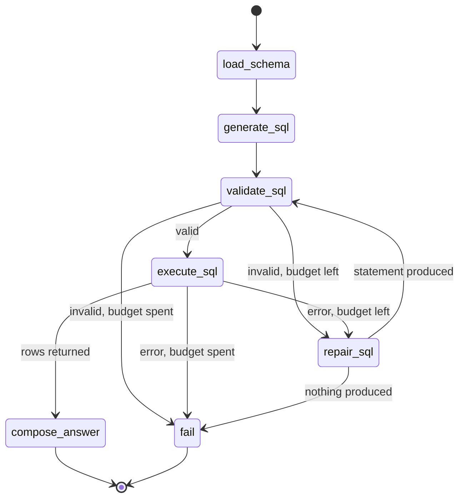

## The problem with the legacy agent

The v0.1 backend bound three tools to a chat model and let the model decide, on
every turn, whether to call one. That single decision produced most of its
defects.

The model chose when to inspect the schema, so a simple question cost at least
four model calls and a model that skipped the inspection wrote SQL against a
schema it had guessed. The model also chose whether to retry, and no counter or
recursion limit bounded that choice, so a model producing broken SQL ran until
something unrelated stopped it. Working state lived in a message transcript that
was trimmed to six messages to stop it growing, which meant the agent's real
state was implicit and no routing decision could be observed without a live
model and a live database.

Most seriously, the tool the model called executed whatever statement it had
been given, after stripping Markdown code fences from it. Nothing between the
model and the database asked whether the statement was read-only.

## What v0.3 changes

The model no longer decides anything. It has no tools. It is called by two nodes
that ask it for a SQL statement, and by one node that asks it to describe rows
that have already been retrieved. Every other decision belongs to the graph.

Seven nodes and thirteen edges, fixed when the graph compiles. The longest path
through it is nine steps, which is why `answer_question` sets an explicit
recursion limit rather than leaving the LangGraph default in place: the graph
cannot loop, so reaching the limit would mean the topology had changed.

## The division of labour

Three parties, each with one job.

| Party | Decides | Cannot |
| --- | --- | --- |
| The model | What SQL to write, and how to describe rows | Execute anything, choose a tool, or see a credential |
| The graph | What runs, in what order, and how many times | Judge whether a statement is safe |
| The database boundary | Whether a statement may execute at all | Be bypassed by rewiring the graph |

The last row is the important one. `validate_sql` calls `assert_read_only_sql`,
and `DatabaseClient.execute` calls it again before touching the driver. The
duplication is deliberate: a mutation cannot reach the database even if the
graph were wired incorrectly.

## State

`AgentState` is a `TypedDict` with thirteen keys, every one of which is always
present. Absence is `None`, never a missing key, so a routing rule never has to
distinguish "not set yet" from "set to nothing". No reducers are declared,
because nothing accumulates: a repaired statement replaces the failed one rather
than being appended to a history.

Input and output are separate types. `AgentInput` is validated because it can
arrive from a notebook or a command line. `AgentOutput` is a frozen dataclass
built by exactly one node per outcome, so a success and a failure always have
the same shape, and `to_output` is the single translation between the two.

The practical consequence is that routing is three pure functions over
dictionaries. The nine routing tests need no model, no database, and no network.

## Dependencies

Nodes receive four callables and a timeout through `AgentDependencies`: load the
schema, draft SQL, write an answer, run a query. Nothing is looked up from a
global while the graph executes.

This is why `agents/nodes.py` imports neither the model SDK nor a database
driver, and why every behavioural test in `tests/unit/test_agent_nodes.py` is a
statement about what the model returned and what the database did. The legacy
module read globals initialised at import time, so importing it opened a
database connection.

## The repair budget

One repair, shared between validation failures and execution failures.

The counter is incremented before the model is called, so a model that raises
still consumes its budget and the run cannot loop. A repaired statement is sent
back through validation and never straight to execution, because it is model
output and therefore exactly as untrusted as the statement it replaced.

Two statements is the maximum the model may write for any question. A model that
produces broken SQL twice is unlikely to be talked round by a third prompt, and
the cost being bounded is the number of statements written, not the number of
times each individual check may fail. That is why both failure types share one
counter.

A generation failure is treated as terminal rather than repairable. There is no
`generate_sql` to `fail` edge, so the drafting node marks the budget as spent and
the run routes to failure after validation. A model that returned no statement
at all has nothing to repair.

## Structured output

The model returns a schema-constrained `SqlDraft`, not prose that has to be
parsed. `SqlDraft` forbids extra fields, so a response carrying a tool call is
rejected rather than partly honoured.

A response containing a Markdown fence is rejected rather than stripped. Under
constrained decoding a fence means something upstream is wrong, and the legacy
habit of quietly removing it hid exactly that.

Two properties of the deployment are pinned as constants in `agents/model.py`
rather than discovered at run time: the structured-output method, and whether
the deployment accepts an explicit sampling temperature. They are facts about a
model version, so changing one should be a reviewed diff rather than an
environment variable. Changing the model version means rechecking both, and
`tests/integration/test_agent_end_to_end.py` fails loudly when the pinned
contract no longer holds.

## Schema context

The whole schema is loaded once per run and rendered into the prompt: every
column, its type, its nullability, its primary key membership, and its foreign
key target. Foreign keys matter most, because inferring join conditions from
column names alone is what the legacy agent got wrong.

AdventureWorksLT has roughly 190 columns, so this costs one query against system
views and removes both the extra model turns and the guessing. Retrieval over a
schema only earns its complexity on a database too large to render, and a cap in
`schema_context.py` makes pointing this code at such a database fail visibly
rather than silently truncate what the model reasons about.

## Alternatives considered

**A prebuilt ReAct agent.** Rejected. It reintroduces exactly the property that
made the legacy agent unsafe, which is the model choosing when to act. An
explicit graph is more code, and every line of that code is a decision that can
be read, tested, and refused.

**Letting the model call a read-only query tool.** Rejected. A tool the model
can call is a tool the model can call twice, or with a different statement than
the one that was validated. Separating drafting from execution means the
statement that was checked is the statement that runs.

**Repairing until success, with a timeout.** Rejected. A timeout bounds cost in
seconds but not in model calls, and it makes the maximum path length a property
of the network rather than of the graph.

**Caching the schema across runs.** Rejected for now. It saves one cheap query
and introduces a class of bug where a session answers from a schema that has
since changed.

**Recording the model contract in settings.** Rejected. A deployment either
supports schema-constrained output or it does not, and making that tunable per
environment invites a configuration where the safety-relevant path differs
between a developer machine and CI.

## Known limitations

The validator matches keywords, so a legitimate query containing a forbidden
word inside a string literal is refused. Refusing a valid query is a worse
experience than allowing one, and a much better failure than the reverse.

There is no persistence, so a follow-up question does not know what the previous
one asked. Answer quality is not measured, because there is no evaluation runner
yet: nothing here claims the answers are correct, only that they are grounded in
rows that were actually retrieved.

## Related

* [releases/v0.3.md](../releases/v0.3.md)
* [architecture/v0.2-python-foundation.md](v0.2-python-foundation.md)
* [roadmap.md](../roadmap.md)
