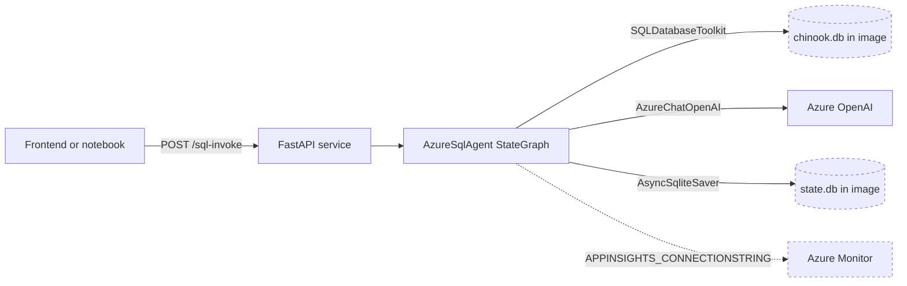

## Runtime topology

The legacy system ran as a single container serving FastAPI on port 80, with the
model hosted in Azure OpenAI and every other dependency embedded in the image.

The three dashed elements each represent a defect. The two databases live inside
the container image, so state is lost on restart and differs per replica. The
Azure Monitor connection is never established, because the code reads
`APPINSIGHTS_CONNECTIONSTRING` while the environment contract defines
`APPLICATIONINSIGHTS_CONNECTION_STRING`.

## Request lifecycle

A call to `POST /sql-invoke` moved through the following steps, drawn from
`api/service.py` and `agents/sql_agent/sql_agent.py`.

1. FastAPI validated the body against `UserInput` from `api/schema.py`.
2. The handler printed the full keyword arguments, including the user question,
   to stdout.
3. The graph was invoked with a thread identifier, resolving prior turns through
   the checkpointer.
4. `list_tables_ai_call` emitted a fabricated tool call with the identifier
   `"tool_abcd123"`, forcing `list_tables_tool` to run.
5. `get_relevant_schema` selected tables, then `get_schema_tool` fetched their
   DDL.
6. `query_agent` generated SQL under a system prompt that asked for SQLite
   syntax, a 50-row cap, and no DML statements.
7. `tool_check` routed either to `execute_query`, which called
   `db.run_no_throw(query)` and looped back on error, or to `generate_answer`.
8. `delete_intermediate_messages` emitted `RemoveMessage` objects, and
   `rolling_window` trimmed history to the last six messages.
9. The response was mapped back through `ChatMessage.from_langchain`.

## Where the design breaks down

Safety is advisory. Step 6 forbids DML in prose only. No validator inspects the
generated SQL, and the database principal has full rights over the file, so the
sole barrier against a destructive statement is model compliance. This is the
single most important property the modernized repository changes.

Errors are swallowed. `db.run_no_throw(query)` returns the error text as a
normal result, so the graph cannot distinguish a failed query from an empty one
without parsing prose.

Import has side effects. Because `tools.py` builds `AzureChatOpenAI` and
`SQLDatabase` at import time, the module cannot be imported without credentials
and cannot be imported from a directory that lacks `chinook.db`. Any test,
notebook, or script has to satisfy both conditions before the first line of its
own code runs.

Context management is a magic number. Trimming to six messages is unrelated to
the model context window, so behaviour changes arbitrarily when the model
changes.

State is not durable. The checkpointer writes to a file inside the container.
Restarting loses conversation history, and running two replicas gives each its
own divergent history.

## What v0.1 replaces

The foundation release changes the substrate before touching the agent, so that
later lessons modernize the graph against a platform that already behaves
correctly.

| Legacy assumption | v0.1 foundation |
| --- | --- |
| SQLite Chinook inside the image | Azure SQL serverless with AdventureWorksLT |
| Full rights over a local file | Read-only database principal, granted in-database |
| Prompt-only DML restriction | Deterministic single-statement read-only validator |
| API keys in environment variables | Microsoft Entra identity, `disableLocalAuth: true` |
| Manually assembled infrastructure | Modular Bicep driven by the azd lifecycle |
| Classic Azure AI Foundry hub and project | Foundry resource with `allowProjectManagement` and a child project |
| Tracing wired to a mismatched variable | Workspace-based Application Insights provisioned as infrastructure |
| Working-directory-relative paths | Paths anchored on the package location |

## Deliberately unchanged

The Text-to-SQL problem stays simple. The agent still answers questions over a
relational sample database, because the purpose of the curriculum is to teach
the platform and the architecture around the agent. Making the agent itself more
elaborate would obscure that.

## Related

- [backend-inventory.md](backend-inventory.md)
- [modernization-risks.md](modernization-risks.md)
- [../architecture/v0.1-azure-foundation.md](../architecture/v0.1-azure-foundation.md)
